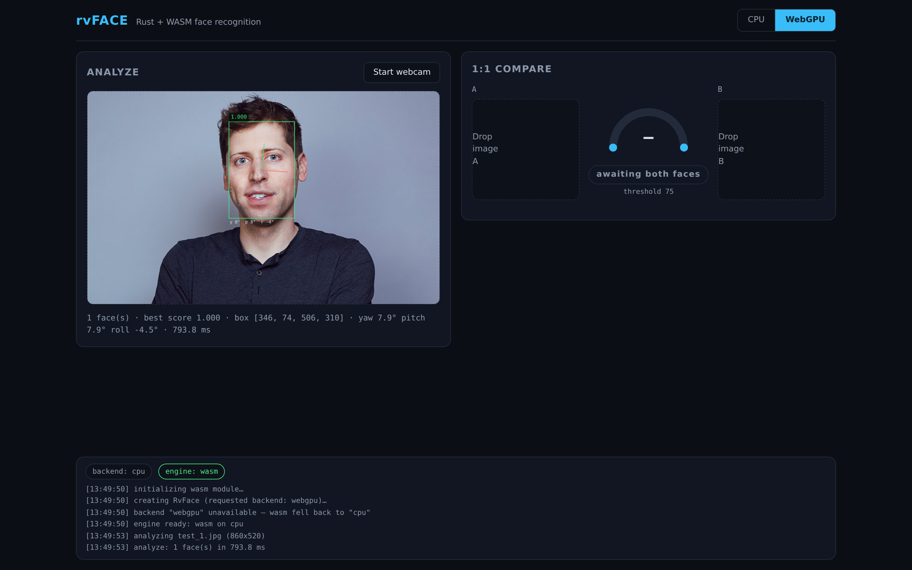
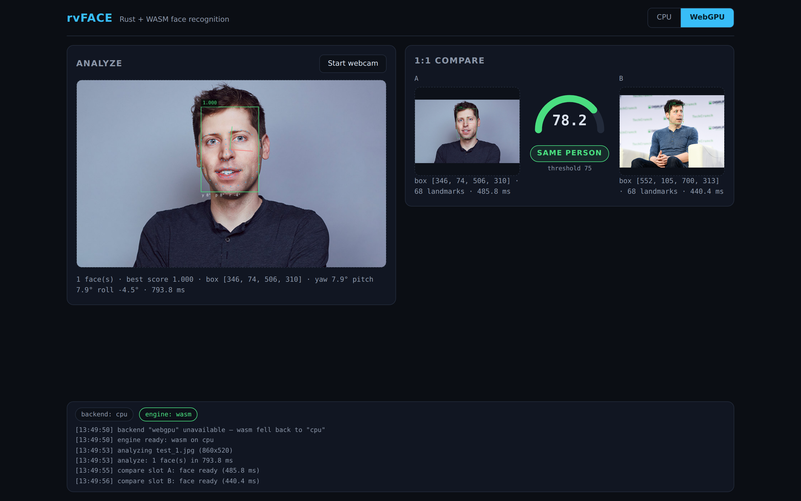

# rvFACE

**Rust + WebAssembly face recognition** — a complete port of the
[Faceplugin Open-Source-Face-Recognition-SDK](https://github.com/Faceplugin-ltd/Open-Source-Face-Recognition-SDK)
(Python/PyTorch) to Rust, running natively and in the browser on **WebGPU or CPU**, with a web UI.


| Analyze: detection · 68 landmarks · pose | 1:1 compare: score gauge · threshold-75 verdict |
|---|---|
|  |  |

## Pipeline

```
image ─► slim-320 SSD detector ─► PIPNet ResNet-18 68-pt landmarks ─► head pose
                                        │
                                        ▼
                   eyes → ArcFace-template alignment (112×112)
                                        │
                                        ▼
             MobileFaceNet-V2 embedder ─► L2-normalized feature
                                        │
                                        ▼
                     similarity = (dot + 1) × 50   (match > 75)
```

## Workspace

| Path | What |
|---|---|
| `crates/rvface-core` | Framework-free pipeline math (priors, NMS, alignment, pose, similarity, image ops) |
| `crates/rvface-models` | [Burn](https://burn.dev) ports of the three CNNs (CPU: ndarray · WebGPU: wgpu) |
| `crates/rvface-cli` | Native CLI (`rvface detect`, `rvface compare`) |
| `crates/rvface-wasm` | Browser bindings (wasm-bindgen) |
| `web/` | Web UI (Vite + TS): upload/webcam, overlays, 1:1 compare, backend toggle |
| `tools/` | Python: weight conversion → safetensors, golden parity fixtures |
| `docs/adrs/` | Architecture decision records (start at [0001](docs/adrs/0001-project-scope-and-layout.md)) |

## Quick start

```bash
# native
cd rvface
python3 tools/fetch_and_convert.py          # download + convert weights → models/
cargo run -p rvface-cli --release -- compare a.jpg b.png

# browser
cd web && npm install && npm run dev        # weights served from web/public/models/
```

## Status

**Complete.** All three networks ported to Burn with PyTorch golden-parity
green (max|Δ| ~1e-7 on real weights), the full pipeline reports *same person*
on the two upstream demo photos (score **82.771**, threshold 75; self-compare
100), and the browser runs the identical engine (wasm, 1.42 MB gzipped, CPU
with SIMD128 or WebGPU with automatic CPU fallback) — no mocks anywhere.

- 66 Rust tests: unit math, seven PyTorch parity fixtures, end-to-end on the
  upstream test images ([validation strategy](docs/adrs/0006-testing-validation-optimization.md))
- [Benchmarks](docs/BENCHMARKS.md): native analyze 176 ms, browser ~0.5 s
  (CPU; includes the 5× denormal-weight fix)
- All three default weights are now **openly licensed and ship with the repo
  + demo** (ADR-0003 + update): detector slim-320 (MIT), PIPNet ResNet-18
  landmarks (MIT, xlite-dev/torchlm), and the foamliu MobileFaceNet-V2 embedder
  (Apache-2.0 — notices in [`models/LICENSES.md`](models/LICENSES.md)).
  `fetch_and_convert.py` produces them and the CI Pages job ships them, so the
  hosted demo runs the **full** pipeline — detection, landmarks, pose,
  ArcFace-template alignment, compare — with **no setup and no drop-zone**.
  Per-file provenance + SHA-256 pins: [`models/README.md`](models/README.md).
  The exact upstream IRN-50 embedder still drops in via `--irn50`.

## License & responsible use

Code is [MIT](LICENSE). The default model weights are openly licensed and
redistributable — detector + PIPNet landmarks (MIT) and the foamliu
MobileFaceNet-V2 embedder (Apache-2.0), with notices in
[`models/LICENSES.md`](models/LICENSES.md) — converted from SHA-256-pinned
upstream releases; per-file licensing is documented in
[`models/README.md`](models/README.md) and
[ADR-0003](docs/adrs/0003-models-weights-licensing.md). Review it before any
commercial use.

This is face-recognition software, i.e. biometric processing. It runs entirely
locally (no telemetry, no network calls at inference). It is intended for
consent-based applications — authentication, personal photo tooling, research.
Do **not** use it for surveillance, tracking, or identification of people who
have not consented, and check the biometric-data laws that apply in your
jurisdiction (e.g. GDPR Art. 9, BIPA) before deployment.
